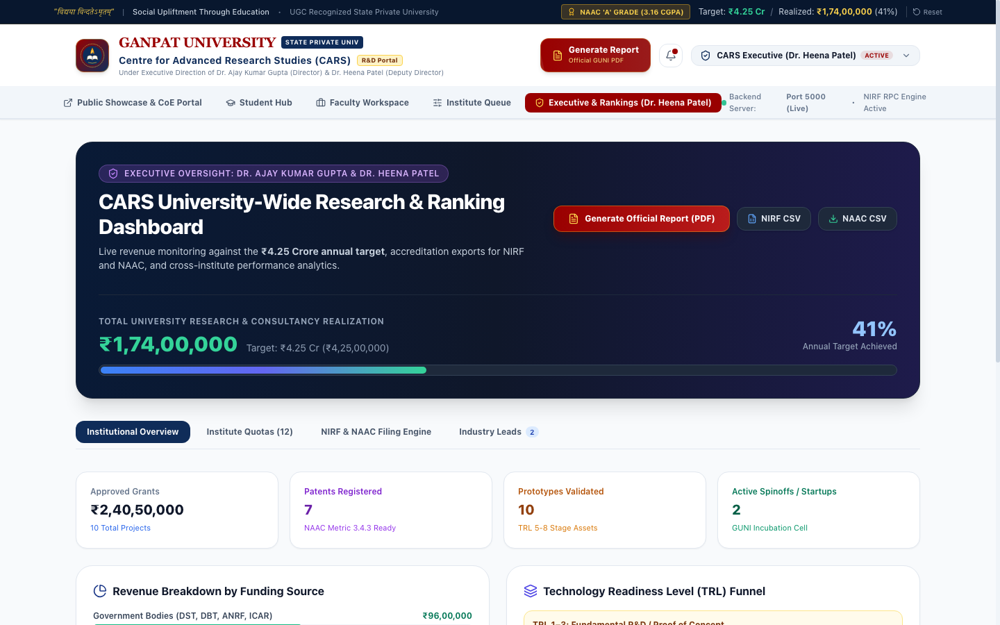
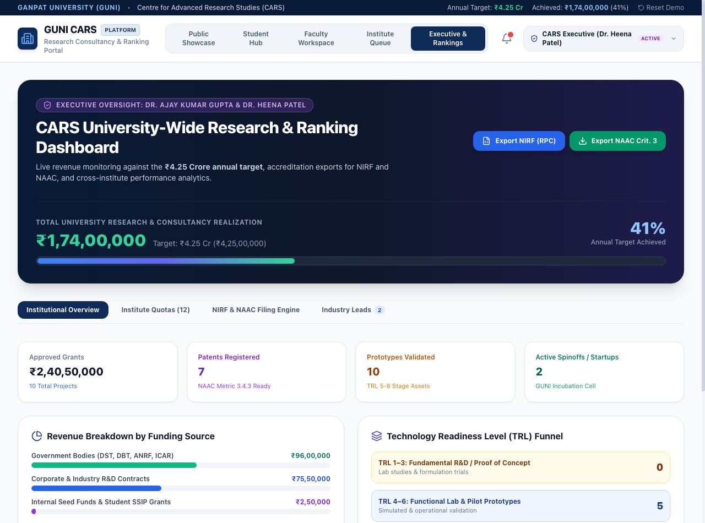
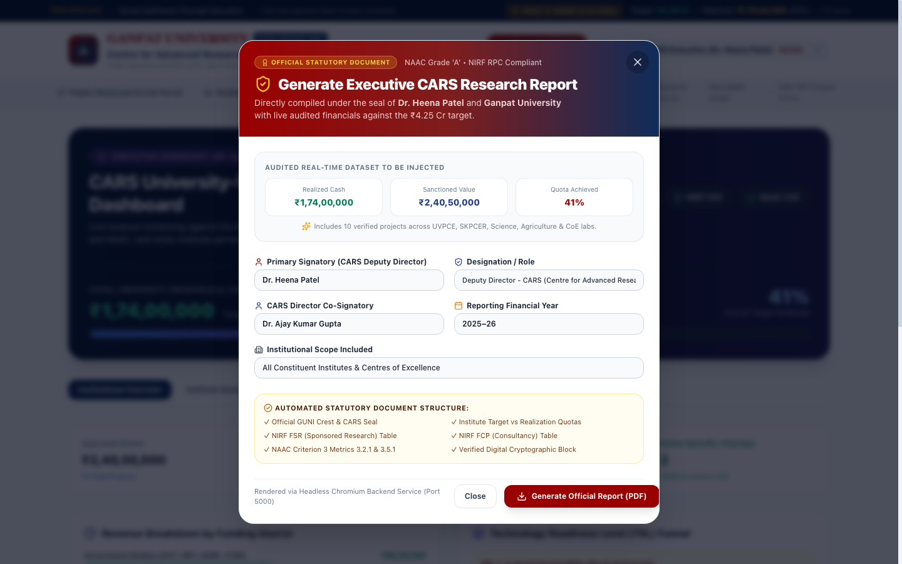
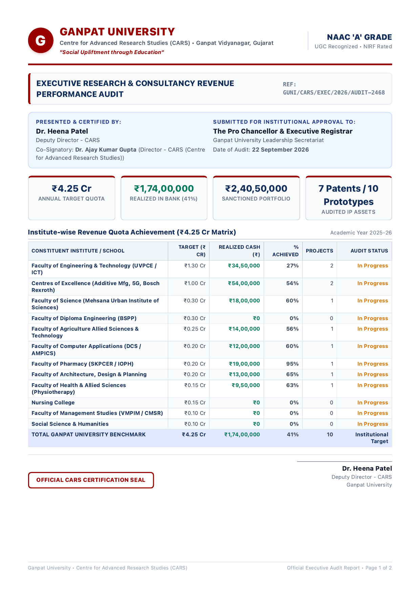
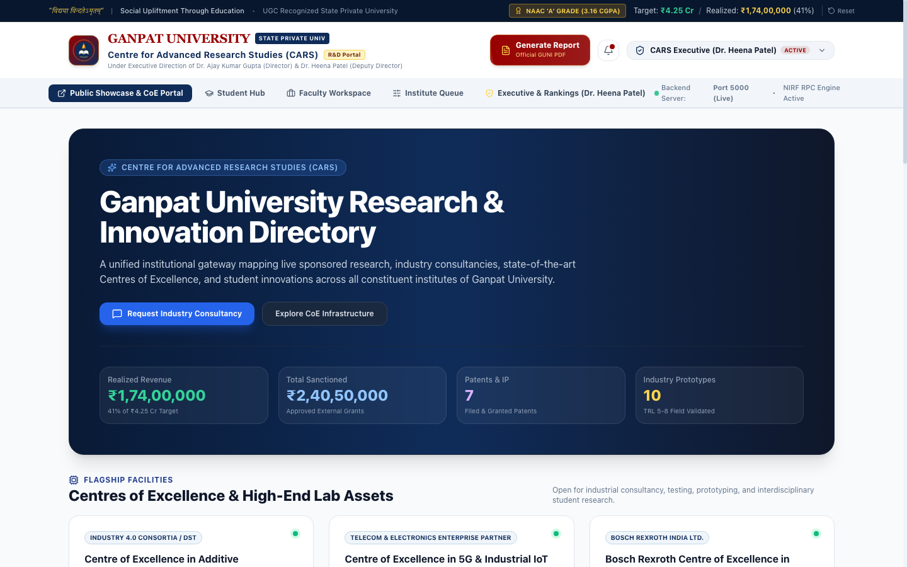
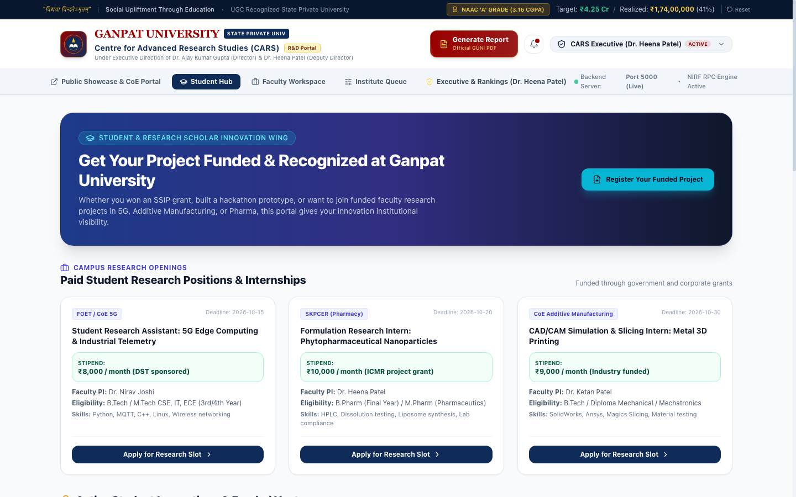
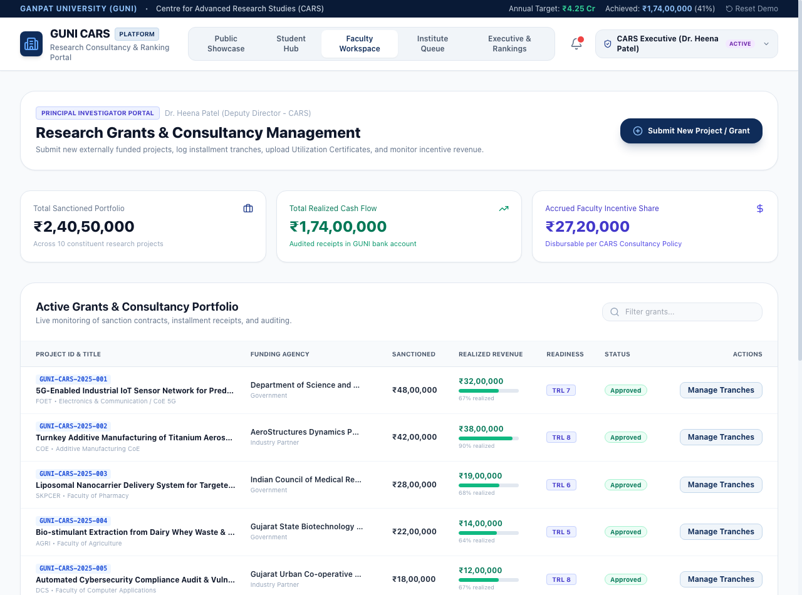
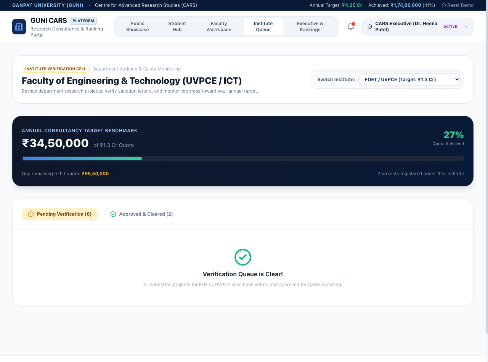

# Ganpat University (GUNI) CARS — Centralized Research Platform

<div align="center">



### Centralized Research & Consultancy Revenue Monitoring, Awareness & Statutory Ranking Platform
**Centre for Advanced Research Studies (CARS) — Ganpat University (GUNI)**

*“विद्यया विन्दतेऽमृतम्” — “Social Upliftment Through Education”*

[](https://reactjs.org/)
[](https://vitejs.dev/)
[](https://tailwindcss.com/)
[](https://nodejs.org/)
[-D4AF37?style=flat-square)](https://www.ganpatuniversity.ac.in/)
[](https://www.ugc.ac.in/)
[](LICENSE)
[](#)
[](https://github.com/InsaneCoder-69/guni-cars-platform/actions)

</div>

---

## 🏛️ Executive Context & Mandate

Under the strategic direction of **Dr. Heena Patel** (*Deputy Director, Centre for Advanced Research Studies - CARS*) and **Dr. Ajay Kumar Gupta** (*Director, CARS*), Ganpat University formulated the comprehensive roadmap:
> **"Consultancy Revenue Enhancement Strategy and Institute-wise Action Plan (2026–2030)"**

This platform serves as the institutional digital backbone to execute this strategy, driving:
* **₹4.25 Crore / Year** baseline consultancy & sponsored research target across all **12 constituent institutes**, scaling to **> ₹5.00 Crore / year** by 2030.
* **150+ Industry-sponsored R&D projects** with corporate leaders and MSMEs.
* **100+ Patents Filed & Commercialized** across advanced engineering, pharmaceuticals, biotechnology, and deep tech.
* **Full Statutory Alignment**: **NEP 2020**, **ANRF (Anusandhan National Research Foundation)**, **NIRF (RPC - FSR & FCP)**, **NAAC (Criterion 3)**, **QS**, **THE**, and **ARIIA**.

---

## ⚡ The Challenge & Solution

```
┌───────────────────────────────────────────────┐
│              THE CURRENT PROBLEM              │
├───────────────────────────────────────────────┤
│ • Data Silos: Research records buried in      │
│   spreadsheets & emails across 12 institutes. │
│ • Audit Data Loss: Scrambling for sanction    │
│   letters & UCs during NIRF / NAAC audits.    │
│ • Zero Visibility: Students and faculty unaware│
│   of high-end campus CoE lab infrastructure.  │
│ • No Target Accountability: No real-time      │
│   tracking against annual revenue quotas.     │
└───────────────────────┬───────────────────────┘
                        │
                        ▼
┌───────────────────────────────────────────────┐
│        GUNI CARS CENTRALIZED PLATFORM         │
├───────────────────────────────────────────────┤
│ 1. Public Awareness & CoE Showcase Portal     │
│ 2. Guided Researcher & Student Hub            │
│ 3. Automated NIRF / NAAC Statutory Reporting  │
│ 4. Executive Quota & Bank Realization Control │
│ 5. Headless Chrome Official PDF Report Engine │
└───────────────────────────────────────────────┘
```

---

## 📸 Key Portals & Visual Walkthrough

### 1. Executive Control Center (Dr. Heena Patel Dashboard)
Real-time macro view of the ₹4.25 Cr revenue quota, institute progress bars, live cash tranche realization, and statutory ranking indicators.



### 2. Official Statutory PDF Generation Engine
Dynamic server-side headless Chrome pipeline generating official, 2-page publication-grade PDF audit reports under Dr. Heena Patel's digital seal.

<div align="center">
  
  
</div>

> 📄 **View Sample Generated Report**: [`GUNI_CARS_Dr_Heena_Patel_Executive_Report_2025_26.pdf`](./GUNI_CARS_Dr_Heena_Patel_Executive_Report_2025_26.pdf)

### 3. Public Showcase & CoE Asset Directory
Discoverable catalog of all active research projects, patents, TRL stages, and Center of Excellence equipment with an integrated industry inquiry funnel.



### 4. Student Innovation & Research Assistantship Hub
Connecting enrolled students with paid research positions, SSIP prototype funding, and faculty-guided patent opportunities.



### 5. Faculty / PI Workspace & Coordinator Audit Queue
Multi-stage workflow for project logging, TRL progress updates, tranche documentation, and department-level verification.

<div align="center">
  
  
</div>

---

## 🏗️ Architecture & Technology Stack

```
┌─────────────────────────────────────────────────────────────────────────────┐
│                    FULL-STACK ARCHITECTURE OVERVIEW                        │
├─────────────────────────────────────────────────────────────────────────────┤
│                                                                             │
│  [FRONTEND: React 18 + Vite 6 + Tailwind CSS (Port 3000 / 3001)]            │
│   • Official GUNI Design Language (Crimson #990000, Navy #0F2C59, Gold)     │
│   • 3-Tier Navigation (Statutory Bar, Institutional Branding, Portal Ribbon)│
│   • Stakeholder Persona Switcher (Public, Student, Faculty, Coordinator, Exec)│
│   • Context-driven State with Optimistic REST Backend Synchronization       │
│                                                                             │
│                                  ▲  HTTP / REST                             │
│                                  │  (JSON & Streamed PDF)                   │
│                                  ▼                                          │
│                                                                             │
│  [BACKEND: Node.js Express 5 Server (Port 5000)]                            │
│   • REST Endpoints: /api/projects, /api/installments, /api/stats, /api/inquiries│
│   • Persistent Ledger: Atomic file-backed JSON store (projects.json)        │
│   • Dynamic PDF Pipeline: Headless Chrome / Puppeteer PDF Compiler          │
│     - Vector-perfect Ganpat University Letterhead & Digital Emblem          │
│     - Multi-page page-break enforcement and isolated CSS print stylesheets  │
│                                                                             │
└─────────────────────────────────────────────────────────────────────────────┘
```

| Layer | Technologies |
| :--- | :--- |
| **Frontend Framework** | React 18, Vite 6 |
| **Styling & Design** | Tailwind CSS 3.4, Lucide Icons, Canvas Confetti |
| **Backend Runtime** | Node.js (ESM), Express 5 |
| **PDF Generation** | Headless Google Chrome / Chromium Print Pipeline |
| **Persistence** | File-backed JSON Datastore with atomic serialization |
| **Brand Identity** | Ganpat University Crimson (`#990000`), Navy (`#0F2C59`), Gold (`#D4AF37`) |

---

## 📊 Constituent Institute Quotas (₹4.25 Cr Target Matrix)

| Constituent Institute | Annual Quota | Target Focus Areas |
| :--- | :--- | :--- |
| **FOET / UVPCE** (Engineering) | ₹1,30,00,000 | 5G-IIoT, Additive Mfg, AI/ML, Robotics, Smart Grid |
| **Centre of Excellence (CoE)** | ₹55,00,000 | Heavy Equipment Testing, Corporate Prototyping |
| **SKPCER** (Pharmacy) | ₹40,00,000 | Formulation R&D, Liposomal Carriers, Clinical Trials |
| **MUIS** (Science) | ₹35,00,000 | Biotechnology, Agrigenomics, Polymer Chemistry |
| **BSPP** (Polytechnic) | ₹25,00,000 | Fabrication, Reverse Engineering, MSME Automation |
| **DCS / AMPICS** (Computer Applications) | ₹30,00,000 | Fintech, Cybersecurity Audits, Cloud Solutions |
| **FMS** (Management) | ₹25,00,000 | MDPs, Supply Chain Optimization, Market Surveys |
| **Agriculture / VAPM** | ₹20,00,000 | Soil Health Testing, Bio-stimulants, Organic Inputs |
| **Architecture / Design** | ₹20,00,000 | Urban Planning, Heritage Restoration, 3D Rendering |
| **Health Sciences** | ₹20,00,000 | Diagnostics, Nutritional Analysis, Ergonomics |
| **Nursing / Allied Health** | ₹15,00,000 | Healthcare Protocols, Hospital Workflow Consulting |
| **Social Sciences & Humanities**| ₹10,00,000 | CSR Impact Assessment, Public Policy Evaluation |
| **TOTAL ANNUAL TARGET** | **₹4,25,00,000** | **12 Institutes Unified Single Source of Truth** |

---

## 🚀 Getting Started

### Prerequisites
* **Node.js**: v18.0.0 or higher
* **npm**: v9.0.0 or higher
* **Google Chrome / Chromium**: Installed locally (required for server-side PDF generation)

### Installation

```bash
# Clone the repository
git clone https://github.com/InsaneCoder-69/guni-cars-platform.git
cd guni-cars-platform

# Install dependencies
npm install
```

### Running the Services

You can run both the backend server and frontend development server:

#### 1. Start the Express Backend Server (Port 5000)
```bash
npm run server
# Server listening on http://localhost:5000
```

#### 2. Start the Vite Frontend (Port 3000 / 3001)
```bash
npm run dev
# Vite server running on http://localhost:3000 (or http://localhost:3001)
```

#### 3. Build for Production
```bash
npm run build
```

---

## 📡 API Reference

| Method | Endpoint | Description |
| :--- | :--- | :--- |
| `GET` | `/api/health` | University system health and uptime metadata |
| `GET` | `/api/stats` | Aggregated revenue, funding breakdown, and 12-institute quota progress |
| `GET` | `/api/projects` | List all research projects (filterable by institute, category, status) |
| `POST` | `/api/projects` | Ingest new research grant or consultancy proposal |
| `POST` | `/api/projects/:id/installments` | Log incoming financial tranche with Utilization Certificate (UC) |
| `PUT` | `/api/projects/:id/approve` | Department coordinator verification approval |
| `GET` | `/api/inquiries` | Retrieve corporate industry consultancy leads |
| `POST` | `/api/inquiries` | Ingest external corporate inquiries from the Public Showcase |
| `POST` | `/api/reports/generate-pdf` | Dynamic Headless Chrome Executive PDF generation pipeline |

### Generating PDF via API
```bash
curl -X POST http://localhost:5000/api/reports/generate-pdf \
  -H "Content-Type: application/json" \
  -d '{"executiveName":"Dr. Heena Patel","designation":"Deputy Director - CARS"}' \
  --output "GUNI_CARS_Executive_Report.pdf"
```

---

## 📁 Repository Structure

```
guni-cars-platform/
├── docs/                                    # Strategic documentation & blueprints
│   ├── ARCHITECTURE_AND_BLUEPRINT.md        # Comprehensive 12-Institute CARS blueprint
│   ├── IMPLEMENTATION_PLAN.md               # Technical full-stack architecture plan
│   ├── WALKTHROUGH.md                       # Verification, test results & demo script
│   └── screenshots/                         # High-resolution platform preview captures
├── server/                                  # Express Backend Service Layer
│   ├── data/                                # Persistent file-backed JSON ledger
│   │   ├── projects.json                    # Active research projects & tranches
│   │   └── inquiries.json                   # Corporate industry leads
│   ├── dataStore.js                         # Atomic CRUD & financial calculations
│   ├── reportGenerator.js                   # Headless Chrome A4 PDF rendering engine
│   └── server.js                            # REST API entrypoint (Port 5000)
├── src/                                     # React 18 Frontend Application
│   ├── components/                          # Reusable UI components & modals
│   │   ├── Navbar.jsx                       # Official 3-tier GUNI brand header
│   │   ├── GenerateReportModal.jsx          # Dr. Heena Patel PDF export modal
│   │   ├── ProjectDetailModal.jsx           # Comprehensive project dossier & tranches
│   │   └── InquiryModal.jsx                 # Corporate consultancy inquiry modal
│   ├── context/                             # React context & API sync layer
│   │   └── PlatformContext.jsx              # Global state with fallback handling
│   ├── data/                                # Baseline seed data
│   │   └── seedData.js                      # Authentic Ganpat University projects & CoEs
│   ├── views/                               # Role-based dashboard views
│   │   ├── CarsExecutiveDashboardView.jsx   # Dr. Heena Patel executive control room
│   │   ├── PublicShowcaseView.jsx           # Public directory & CoE lab showcase
│   │   ├── StudentHubView.jsx               # Student paid openings & SSIP grants
│   │   ├── FacultyWorkspaceView.jsx         # PI grant logger & tranche tracker
│   │   └── CoordinatorQueueView.jsx         # Institute department verification queue
│   ├── App.jsx                              # Main application container
│   ├── index.css                            # Global styles & typography
│   └── main.jsx                             # React root bootstrap
├── Consultancy Revenue Enhancement Strategy and Institute.docx # Original source proposal
├── GUNI_CARS_Platform_Blueprint.pdf         # Official CARS platform blueprint PDF
├── GUNI_CARS_Dr_Heena_Patel_Executive_Report_2025_26.pdf # Sample generated executive report
├── index.html                               # HTML entrypoint with GUNI favicon
├── package.json                             # Dependencies and npm scripts
├── tailwind.config.js                       # Official GUNI brand color theme
└── vite.config.js                           # Vite configuration
```

---

## 📚 Complete Project Documentation

* [Production Deployment Guide](DEPLOYMENT.md)
* [Platform Blueprint & Architecture](docs/ARCHITECTURE_AND_BLUEPRINT.md)
* [Full-Stack Implementation Plan](docs/IMPLEMENTATION_PLAN.md)
* [Walkthrough & Verification Dossier](docs/WALKTHROUGH.md)
* [Contribution & Development Guidelines](CONTRIBUTING.md)
* [Official Presentation HTML Slide Deck](blueprint_presentation.html)

---

## 👤 Author & Repository Owner

* **Owner**: [Vatsal Trivedi](https://github.com/InsaneCoder-69) (`@InsaneCoder-69`)
* **Developed for**: Centre for Advanced Research Studies (CARS), Ganpat University (GUNI)
* **Under Leadership of**: **Dr. Heena Patel** (*Deputy Director - CARS*) & **Dr. Ajay Kumar Gupta** (*Director - CARS*)

---

<div align="center">
  <b>Ganpat University</b> • Kherva, Mehsana-Gozaria Highway, Gujarat - 384012, India<br>
  <i>UGC Recognized State Private University | Accredited with 'A' Grade by NAAC</i>
</div>
