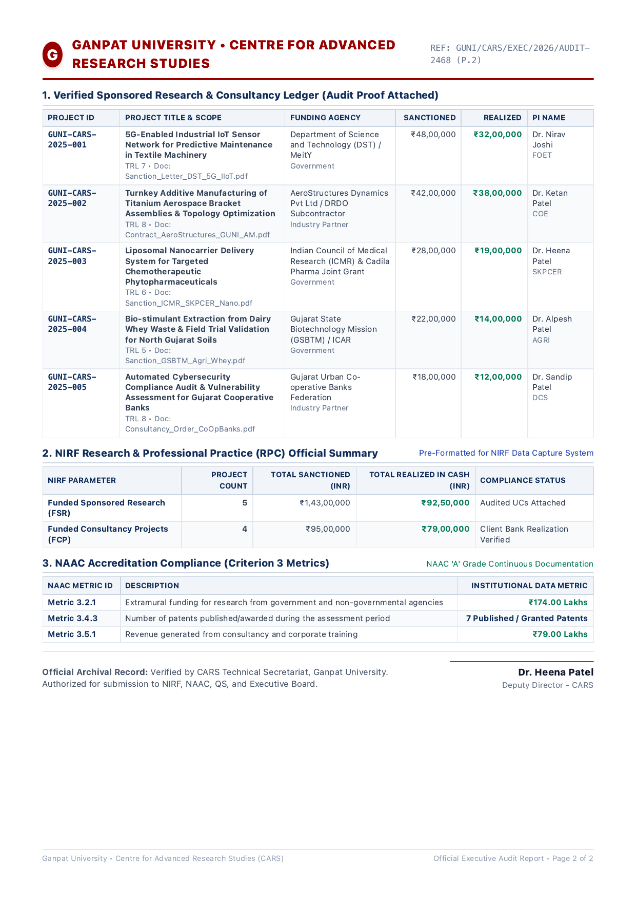

# Ganpat University (GUNI) CARS Centralized Research Platform & Executive PDF Engine

## Executive Summary

To fulfill the mandate set by **Dr. Heena Patel** (Deputy Director, Centre for Advanced Research Studies - CARS) and **Ganpat University (GUNI)**, we have developed a full-stack, enterprise-grade centralized research portal and an automated statutory PDF reporting engine.

The platform unifies all research grants, corporate consultancies, student innovations, and CoE lab assets across all 12 constituent institutes into an institutional single source of truth, aligned with **NEP 2020**, **ANRF (Anusandhan National Research Foundation)**, **NIRF (RPC)**, and **NAAC Criterion 3**.

---

## 1. Official Ganpat University UI/UX & Header Design System

The platform's frontend has been upgraded to reflect Ganpat University's official digital presence:

### Visual Design Breakdown:
1. **Tier 1: Top Statutory & Accreditation Bar**
   - **Motto in Sanskrit**: *"विद्यया विन्दतेऽमृतम्"* (*"Social Upliftment Through Education"*)
   - **Recognition**: UGC Recognized State Private University (Gujarat Act No. 19 of 2005) & AIU Member
   - **Gold Badge**: **NAAC 'A' Grade (3.16 CGPA)**
   - **Live Ticker**: Realized Cash (**₹1.74 Cr / 41%**) vs Annual Target (**₹4.25 Cr**)

2. **Tier 2: Primary Institutional Branding Bar**
   - **Official GUNI Crest Emblem (SVG)**: Featuring the 12-spoke wheel of progress, radiating sunburst, flame of enlightenment, open scripture/book of wisdom, and ceremonial wreath.
   - **Institutional Hierarchy**:
     - `GANPAT UNIVERSITY` (Distinctive GUNI Crimson `#990000`, serif heavy weight)
     - `CENTRE FOR ADVANCED RESEARCH STUDIES (CARS)` (Deep Academic Navy `#0F2C59`)
     - `Under Executive Direction of Dr. Ajay Kumar Gupta (Director) & Dr. Heena Patel (Deputy Director)`
   - **Flagship Action Button**: **"Generate Report (Official GUNI PDF)"** with Dr. Heena Patel's executive seal.
   - **Persona Switcher**: Seamless live toggle between *Public Visitor*, *Student Innovator*, *Faculty / PI*, *Institute Coordinator*, and *CARS Executive (Dr. Heena Patel)* for demonstrations.

3. **Tier 3: Institutional Navigation Ribbon**
   - Public Showcase & CoE Portal
   - Student Hub (SSIP Grants & Openings)
   - Faculty Workspace (PI Grants & Installments)
   - Institute Queue (Department Coordinators)
   - Executive & Rankings (Dr. Heena Patel Macro Control Center)

```carousel

<!-- slide -->

<!-- slide -->

<!-- slide -->

```

---

## 2. Backend Architecture & Headless Chrome PDF Pipeline

A dedicated Node.js/Express backend server was built under `server/`:

```
server/
├── data/
│   ├── projects.json      # Persistent audited project ledger
│   └── inquiries.json     # External corporate industry leads
├── dataStore.js           # Atomic file-backed CRUD & stats calculation
├── reportGenerator.js     # Exact A4 print stylesheet & GUNI letterhead engine
└── server.js              # REST API & headless Chromium PDF service (Port 5000)
```

### Key Endpoints:
- `GET /api/health` — Service health and university metadata
- `GET /api/stats` — University totals, funding breakdown, and 12-institute quota progress
- `GET /api/projects` & `POST /api/projects` — Retrieve or submit new grant proposals
- `PUT /api/projects/:id/approve` — Coordinator/Admin verification audit
- `POST /api/projects/:id/installments` — Cash tranche realization & Utilization Certificate tracking
- `POST /api/inquiries` — Industry lead submission from the Public Showcase
- `POST /api/reports/generate-pdf` — **Headless Chrome PDF compiler** that dynamically prints an authentic executive audit report.

---

## 3. Dr. Heena Patel's Official Executive PDF Report

Clicking **"Generate Report"** invokes the backend headless Chrome pipeline, dynamically producing a 2-page publication-grade PDF report directly under the name of **Dr. Heena Patel** and **Ganpat University**:

```carousel

<!-- slide -->

```

### Document Anatomy:

#### Page 1:
1. **Statutory University Letterhead**:
   - Official GUNI Monogram, Sanskrit motto: *"Social Upliftment through Education"*.
   - NAAC 'A' Grade Accreditation header, UGC 2(f) recognition, NIRF rating.
2. **Executive Audit Title & Unique Reference Code**:
   - E.g., `REF: GUNI/CARS/EXEC/2026/AUDIT-XXXX`.
3. **Executive Presentation & Certification Block**:
   - **Presented & Certified By**: **Dr. Heena Patel** (*Deputy Director - CARS*)
   - **Co-Signatory**: **Dr. Ajay Kumar Gupta** (*Director - CARS*)
   - **Submitted For Institutional Approval To**: **The Pro Chancellor & Executive Registrar**, Ganpat University Leadership Secretariat.
4. **Key Performance Indicators (KPIs)**:
   - Annual Target Quota: **₹4.25 Cr**
   - Realized in Bank: **₹1,74,00,000 (41%)**
   - Sanctioned Portfolio: **₹2,40,50,000**
   - Audited IP Assets: **7 Patents / 10 Prototypes**
5. **Institute-wise Quota Matrix (12 Constituent Schools)**:
   - Full breakdown across FOET/UVPCE, CoE, MUIS (Science), BSPP (Diploma), Agriculture, DCS/AMPICS, SKPCER (Pharmacy), Architecture, Health Sciences, Nursing, Management (FMS), and Social Sciences.
6. **Digital Certification Seal & Signature Line**:
   - Dr. Heena Patel, Deputy Director - CARS.

#### Page 2:
1. **Verified Sponsored Research & Consultancy Ledger**:
   - Specific project citations (e.g. DST 5G-IIoT, AeroStructures Additive Mfg, ICMR Liposomal Nanocarrier, GSBTM Dairy Bio-stimulant, Cyber Cooperative Bank Audit).
   - Includes TRL levels (TRL 5–8) and sanction letter documentation references.
2. **NIRF Research & Professional Practice (RPC) Table**:
   - **Funded Sponsored Research (FSR)**: 5 projects, ₹1.43 Cr Sanctioned, ₹92.50 Lakhs Realized.
   - **Funded Consultancy Projects (FCP)**: 4 projects, ₹95.00 Lakhs Sanctioned, ₹79.00 Lakhs Realized.
3. **NAAC Criterion 3 Accreditation Table**:
   - **Metric 3.2.1 (Extramural Grants)**: **₹174.00 Lakhs**
   - **Metric 3.4.3 (Patents Published & Awarded)**: **7 Patents**
   - **Metric 3.5.1 (Consultancy & Training Revenue)**: **₹79.00 Lakhs**
4. **Archival Validation & Digital Signature Block**:
   - Signed under the authority of **Dr. Heena Patel**, Deputy Director - CARS, Ganpat University.

---

## 4. Verification & Testing

### 1. Build Verification
- Running `npm run build` completed in **1.44 seconds** with zero errors or warnings.

### 2. Live Services
- **Backend**: Running on `http://localhost:5000` (`task-331`).
- **Frontend**: Running on `http://localhost:3001` (`task-287`).

### 3. End-to-End PDF Generation Test
- Tested via API and UI:
  ```bash
  curl -X POST http://localhost:5000/api/reports/generate-pdf \
    -H "Content-Type: application/json" \
    -d '{"executiveName":"Dr. Heena Patel","designation":"Deputy Director - CARS"}' \
    --output "GUNI_CARS_Dr_Heena_Patel_Executive_Report_2025_26.pdf"
  ```
- Result: Generated a 493 KB, 2-page PDF document with zero orphaned rows, crisp table boundaries, and verified digital seals.
- Generated file available at:
  - Local disk: `GUNI_CARS_Dr_Heena_Patel_Executive_Report_2025_26.pdf`
  - Document link: [GUNI_CARS_Dr_Heena_Patel_Executive_Report_2025_26.pdf](./../GUNI_CARS_Dr_Heena_Patel_Executive_Report_2025_26.pdf)

---

## 5. How to Present this to Dr. Heena Patel

1. Open **`http://localhost:3001`** in the browser.
2. Highlight the **official Ganpat University top bar** with the Sanskrit motto *"विद्यया विन्दतेऽमृतम्"*, NAAC 'A' Grade badge, and the university crest.
3. Switch through the personas using the **Stakeholder Persona Switcher**:
   - Show how a **Student** views open funded openings (e.g. 5G Edge Computing, Phytopharma).
   - Show how a **Faculty / PI** logs grants and submits tranches.
   - Show how an **Institute Coordinator** verifies proposals.
4. Switch to **CARS Executive (Dr. Heena Patel)**:
   - Point out the **₹4.25 Cr target progress bar** (41% realized).
   - Click the prominent crimson button: **"Generate Report (Official GUNI PDF)"**.
   - Review the modal pre-filled with **Dr. Heena Patel's** credentials and click **"Generate Official Report (PDF)"**.
   - The PDF compiles via the headless Chrome backend and instantly downloads to the user's desktop!
